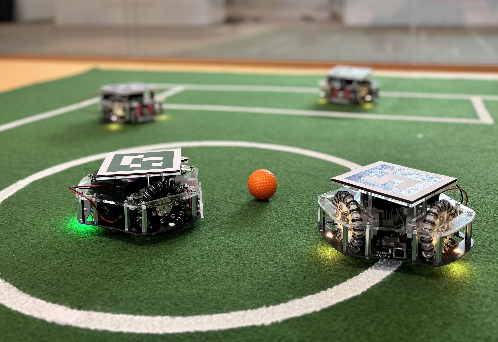

# Códigos de Ejemplo para hacer pruebas de funcionamiento de Hardware de RobotSoccer Kit

En las siguieentes carpetas podrás encontrar el software necesario para hacer las pruebas sobre tu RobotSoccer. Cada una de las carpetas es para hacer una prueba específica sobre alguna de las partes hardware de los Robots. 

    

* **ProgramaMaestroBluetooth:** para usar este código es necesario que tengamos cargado en nuestro Robot el código oficial del robot y que al encenderlo hay que girar una de las ruedas para que pueda entrar en modo bluetooth.

* **PruebaBuzzer:** con este código conseguimos que el buzzer emita dos melodías una detrás de la otra. No es repetitivo lo hará una única vez.

* **PruebaEncoder:** Programa para probar los pines de los encoders del RobotSoccerKit, esta prueba está pensada para que por la terminal nos dé el estado del encoder de cada motor. Los valores que sacará son 0 o 1 y lo importante es que cambién al girar el motor. 

* **PruebaLed:** Utilizando la librería FastLed generamos un programa que ilumina los 6 Leds del RobotSoccer kit con colores aleatorios.

* **PruebaMotores:** este pequeño programa nos permite probar el funcionamiento de los motores independientemente. Cambiar los pines para poder probar cada uno de los motores, pero la prueba consiste en que el motor gire en un sentido durante 1sg se pare y gire en sentido contrario otro segundo.

* **PruebaKicker:** prueba para el funcionamiento del kicker, si la prueba es correcta el kicker chutará dos veces y se detendrá.